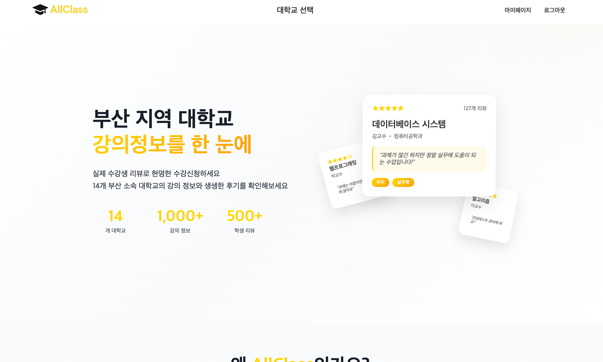
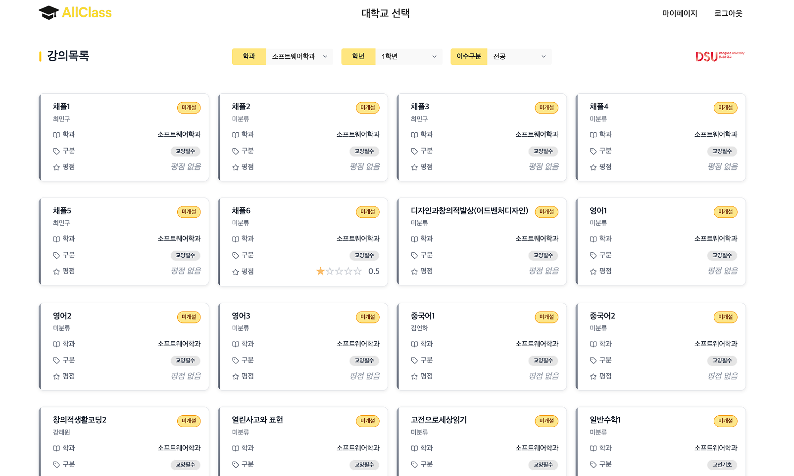
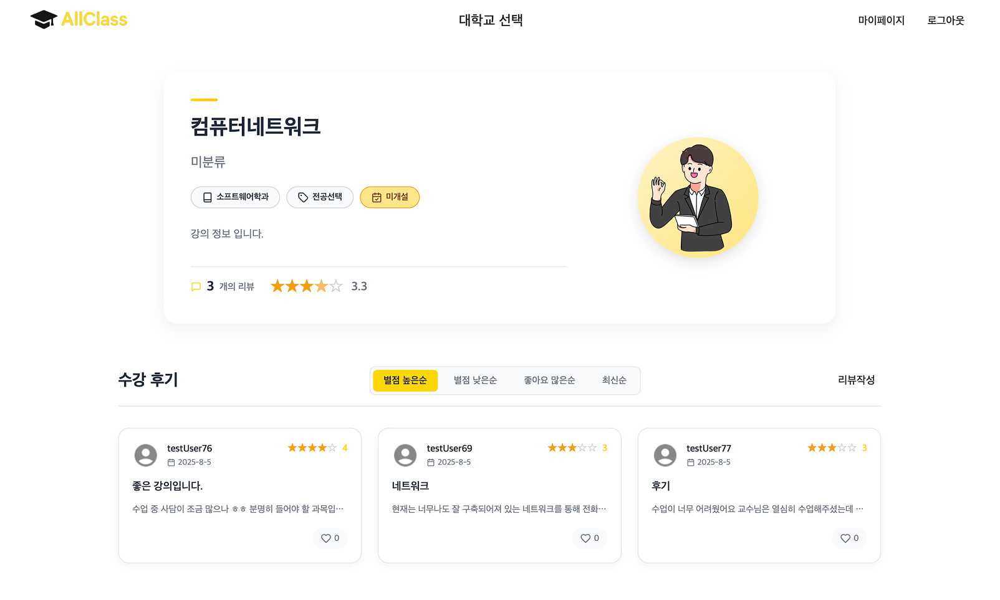
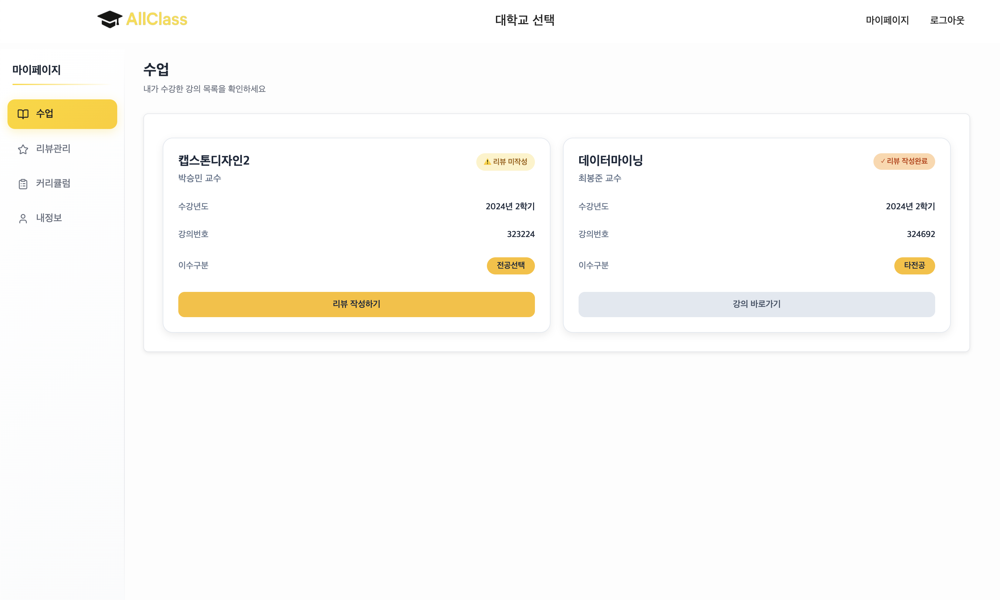

# AllClass

> 부산 지역 대학생들을 위한 강의 리뷰 플랫폼

**배포 링크**: [https://all-class.vercel.app/](https://all-class.vercel.app)

## 🎯 프로젝트 개요

AllClass는 학부 연구실 창업동아리에서 시작하여 예비창업을 준비하기까지 약 2년동안 진행한 수업리뷰 관리 시스템입니다. 교내 학과 50여명이 직접 수강후기를 작성하며 운영되었으며, 부산 전지역으로 확대하는 것을 목표로 했던 플랫폼입니다.

기존에는 강의 선택 시 참고할 수 있는 정보가 제한적이었지만, AllClass를 통해 실제 수강생들의 생생한 리뷰와 평가를 바탕으로 학생들이 보다 투명하고 신뢰할 수 있는 강의 정보를 얻을 수 있습니다.

이 프로젝트는 한 달간 진행된 리라이팅 과정의 기록이기도 합니다. 해커톤에서 시작된 레거시 코드를 개선하며 겪은 기술적 도전과 해결 과정을 블로그를 통해 상세히 기록했습니다.

## 📋 프로젝트 중점사항

### 사용자 경험 최적화
- **렌더링 전략**: SSG/ISR/하이브리드를 활용한 페이지별 최적화
- **성능 지표**: Core Web Vitals 기준으로 지속적인 성능 모니터링

### 확장 가능한 아키텍처
- **도메인 단위 구조**: 4개 도메인(auth, lecture, review, mypage)으로 명확한 분리
- **컴포넌트 설계**: 재사용 가능하고 테스트 가능한 모듈형 구조
- **타입 안전성**: TypeScript 100% 적용으로 런타임 오류 방지

### 안정적인 개발 환경
- **E2E 테스트**: Cypress를 통한 핵심 사용자 플로우 자동화 검증
- **CI/CD 파이프라인**: GitHub Actions를 통한 배포 자동화

## 🛠️ 기술적 이슈 해결 과정

리라이팅 과정에서 마주한 문제들과 해결 과정을 블로그에 기록했습니다:

| 단계 | 제목 | 핵심 문제 | 해결 방법 | 성과 | 링크 |
|------|------|-----------|-----------|------|------|
| **1** | 해커톤 코드가 만든 재앙과 리라이팅 구원계획 | 모든 페이지 SSR로 인한 성능 저하 | SSG/ISR 렌더링 전략 수립 | 프로젝트 방향성 정립 | [📖 Post #5](https://solplog.vercel.app/articles/post-5) |
| **2** | 조건부 렌더링의 브라우저 이미지 캐시 무효화 | 이미지 재로딩으로 인한 UX 저하 | CSS visibility + React.memo 최적화 | 이미지 깜빡임 완전 제거 | [📖 Post #6](https://solplog.vercel.app/articles/post-6) |
| **3** | 도메인 단위 구조에 Next.js 끼얹어보기 | 분산 폴더 구조의 개발 효율성 저하 | 도메인 + 기술적 레이어 하이브리드 설계 | 파일 크기 36% 감소 | [📖 Post #7](https://solplog.vercel.app/articles/post-7) |
| **4** | 캐싱 레이어 분리로 평점 즉시 업데이트하기 | 정적 데이터와 실시간 업데이트 충돌 | ISR + React Query 하이브리드 캐싱 | 서버 부하 감소 + 실시간성 확보 | [📖 Post #8](https://solplog.vercel.app/articles/post-8) |
| **5** | 서버-클라이언트 상태 동기화로 UI Flickering 제거 | 페이지 새로고침 시 UI 깜빡임 | SSR Hydration + dehydrate/hydrate | 매끄러운 페이지 전환 | [📖 Post #9](https://solplog.vercel.app/articles/post-9) |
| **6** | 사용자 플로우 중심의 E2E 테스트 개선기 | UI 테스트 과다로 인한 비효율성 | 실제 API + 핵심 플로우 중심 테스트 | 핵심 플로우 자동화 검증 | [📖 Post #10](https://solplog.vercel.app/articles/post-10) |
| **7** | AllClass 리라이팅 프로젝트 회고 | 레거시 시스템 완전 전환 | 정량적 성과 분석 및 교훈 도출 | Lighthouse 성능 69→100점, 코드 18.7% 효율화 | [📖 Post #11](https://solplog.vercel.app/articles/post-11) |

## 📊 주요 성과

### 🚀 성능 개선
- **LCP**: 2.5초 → 0.7초 (72% 개선)
- **FCP**: 2.1초 → 0.5초 (76% 개선)
- **Speed Index**: 4.6초 → 0.9초 (80% 개선)
- **정적 페이지 생성**: 8개 → 84개 (10.5배 증가)
- **Lighthouse 성능 점수**: 69 → 100점 (+31점)

### 🏗️ 아키텍처 개선
- **코드 라인**: 6,750줄 → 5,488줄 (18.7% 감소)
- **평균 파일 크기**: 80줄 → 51줄 (36% 감소)
- **의존성**: 23개 → 6개 (74% 감소)
- **도메인 분리**: 4개 도메인으로 명확한 구조

### 📦 번들 최적화
- **강의 목록 페이지**: 183kB → 138kB (25% 감소)
- **강의 상세 페이지**: 249kB → 146kB (41% 감소)
- **코드 스플리팅**: 단일 청크 77.4kB → 최대 4.72kB 모듈
- **TypeScript 적용**: 0% → 100% 타입 안전성 확보

## 🔧 사용 기술 및 환경

### Frontend
- **Framework**: Next.js 15.3.5 (App Router)
- **Language**: TypeScript 5.8.3
- **Styling**: CSS Modules
- **State Management**: Zustand 5.0.6
- **Data Fetching**: TanStack Query 5.83.0
- **Animation**: Framer Motion 12.23.12

### Development & Testing
- **Testing**: Cypress 14.5.1 (E2E)
- **Code Quality**: ESLint, Prettier
- **Package Manager**: Yarn

### Deployment & Infrastructure
- **Deployment**: Vercel
- **CI/CD**: GitHub Actions
- **Monitoring**: Vercel Analytics

## 🎨 UI 설계

  
  
  

  메인 랜딩 페이지 | 메인 페이지 | 강의 상세 페이지

 

  
  

  마이페이지 - 강의 관리 | 마이페이지 - 리뷰 관리

## 🔗 관련 링크

### 📋 Use Case

**[📖 AllClass Use Case Wiki](https://github.com/all-classs/all-class-server/wiki/Use-Case)**

### 백엔드 레포지토리

**[🔧 AllClass Backend Server](https://github.com/all-classs/all-class-server)**

### AllClass 프로젝트 레거시 코드
현재 리라이팅된 버전 이전의 프로젝트 변천사를 확인할 수 있습니다:

| 버전 | 설명 | 링크 |
|------|------|------|
| **v0.0.0** | 2023년 교내 창업동아리 버전 | [📁 release/0.0.0](https://github.com/all-classs/All-Class/tree/release/0.0.0) |
| **v0.0.1** | 2024년 부산 ICT 해커톤 버전 | [📁 release/0.0.1](https://github.com/all-classs/All-Class/tree/release/0.0.1) |
| **v0.0.2** | 2024년 대한민국 해커톤 버전 | [📁 release/0.0.2](https://github.com/all-classs/All-Class/tree/release/0.0.2) |

